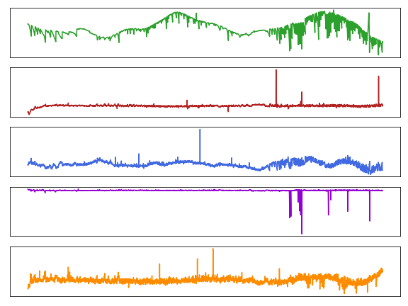
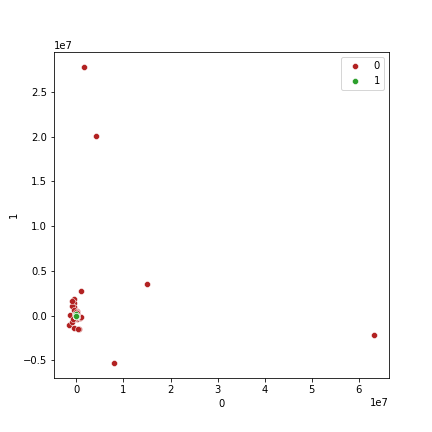
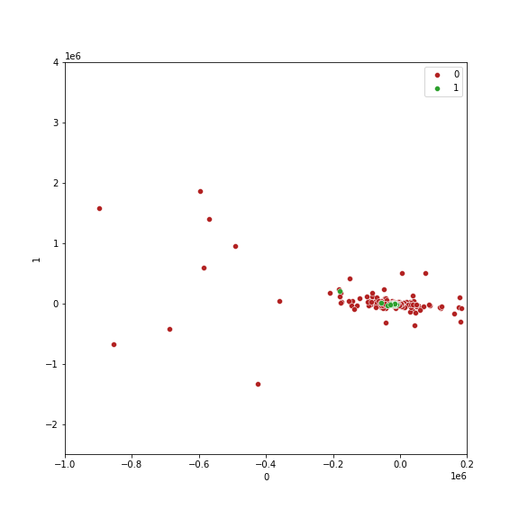

# Exoplanet Hunting in Deep Space on Amazon Sagemaker

Using the Exoplanet dataset via [Kaggle](https://www.kaggle.com/keplersmachines/kepler-labelled-time-series-data), I built a binary classification neural network in [PyTorch](https://pytorch.org/) to find exoplanets based on the change in flux (light intensity) of stars.



## The Dataset

The training dataset consists of a 5087x3198 matrix, with the label column containing values of 2, a star containing one or more exoplanets in orbit, and 1, a star with no exoplanets in orbit. The test is a 570x3198 matrix containing the same label columns. In order to get our predictions to be in line with the predicted probabilities of a class (between 0-1) the labels need to be adjusted to 1 and 0:

```python
orig_train = pd.read_csv("data/exoTrain.csv")
orig_train['LABEL'] = orig_train['LABEL'] - 1
orig_train.to_csv("data/Train.csv", index=False)

orig_test = pd.read_csv("data/exoTest.csv")
orig_test['LABEL'] = orig_test['LABEL'] - 1
orig_test.to_csv("data/Test.csv", index=False)
```

### Visualize the data via Principal Component Analysis

[Interactive 3D Plot of the data transofrmed by PCA ](https://htmlpreview.github.io/?https://github.com/Alec-Schneider/exoplanets/blob/main/data/pca3_plot.html)

#### Scatter Plot of the PCA Transformed data



#### Zoomed in view of the data by label



As we can see from the plots above, the dataset is heavily imbalanced with 5050, or 99.27%, of the training data consisting of label=0. To alleviate this during training, we can rebalance the datasetby by passing a sampler to the [DataLoader](https://pytorch.org/docs/stable/data.html?highlight=dataloader#torch.utils.data.DataLoader) that will be passed to our PyTorch model. An implementation of a Imbalanced dataset sampler exists [here](https://github.com/ufoym/imbalanced-dataset-sampler), so I forked it to make an edit for the custom [TensorDataset](https://pytorch.org/docs/stable/data.html?highlight=tensordataset#torch.utils.data.TensorDataset) that is being used in this project.

With a solution to the imbalance, I'll define a function to retrieve a DataLoader.

```python
def get_data_imbalanced_loader(batch_size, training_dir, filename):
    """
    Fetch a dataset and return a DataLoader with an ImbalancedDatasetSampler used to
    sample an imbalanced dataset.
    """
   logger.info("Get data loader")

   data = pd.read_csv(os.path.join(training_dir, filename))
   labels = data.LABEL.values
   features = data.loc[:, data.columns != "LABEL"].values

   tensor_labels = torch.tensor(labels)
   tensor_features = torch.tensor(features)

   dataset = TensorDataset(tensor_features, tensor_labels)

   tensor_dataloader = DataLoader(dataset, batch_size=batch_size,
                                  sampler=ImbalancedDatasetSampler(dataset, labels))

   return tensor_dataloader
```

## Training The Classifier

```python
class CNN(nn.Module):
    def __init__(self):
        super(CNN, self).__init__()
        self.conv1 = nn.Conv1d(1, 6, 3)
        self.b_norm1 = nn.BatchNorm1d(6)
        self.conv2 = nn.Conv1d(6, 16, 3)
        self.b_norm2 = nn.BatchNorm1d(16)
        self.fc1 = nn.Linear(16 * 354, 500)
        self.fc2 = nn.Linear(500, 64)
        self.fc3 = nn.Linear(64, 1)

    def forward(self, x):
        # Transform the input shape of the batch
        x = torch.unsqueeze(x, 2)
        x = x.view(x.shape[0], x.shape[2], x.shape[1])
        x = F.max_pool1d(F.relu(self.conv1(x)), 3)
        x = self.b_norm1(x)
        x = F.max_pool1d(F.relu(self.conv2(x)), 3)
        x = self.b_norm2(x)
        x = x.view(-1, 16 * 354)
        x = F.relu(self.fc1(x))
        x = F.relu(self.fc2(x))
        x = torch.sigmoid(self.fc3(x))

        return x
```
